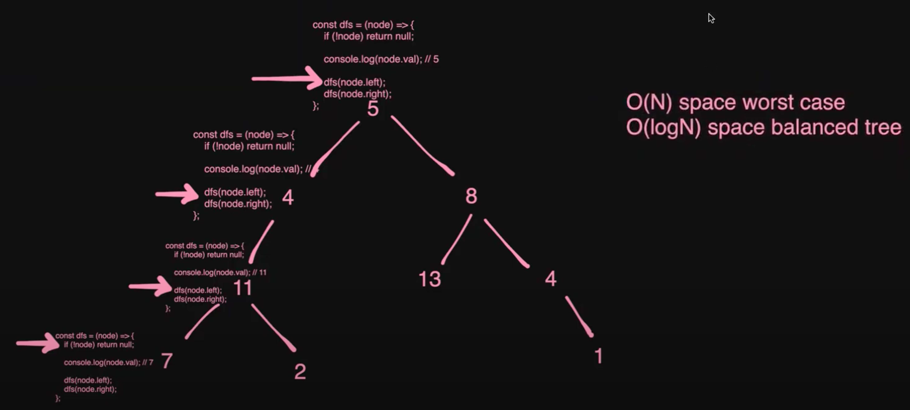
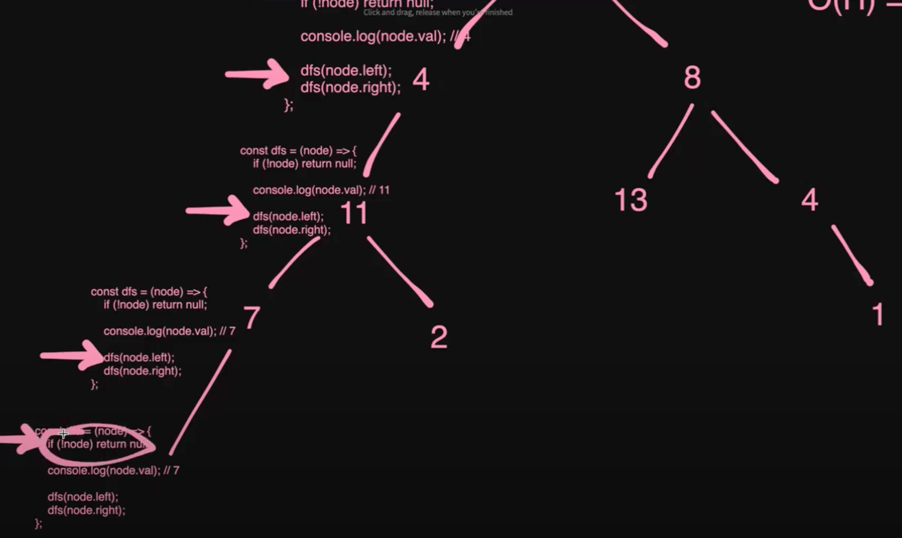
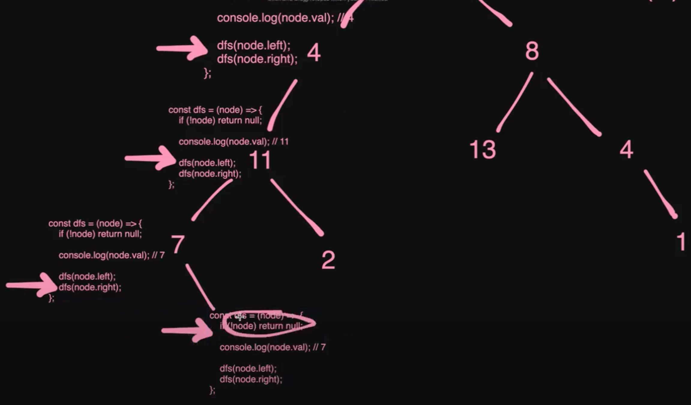
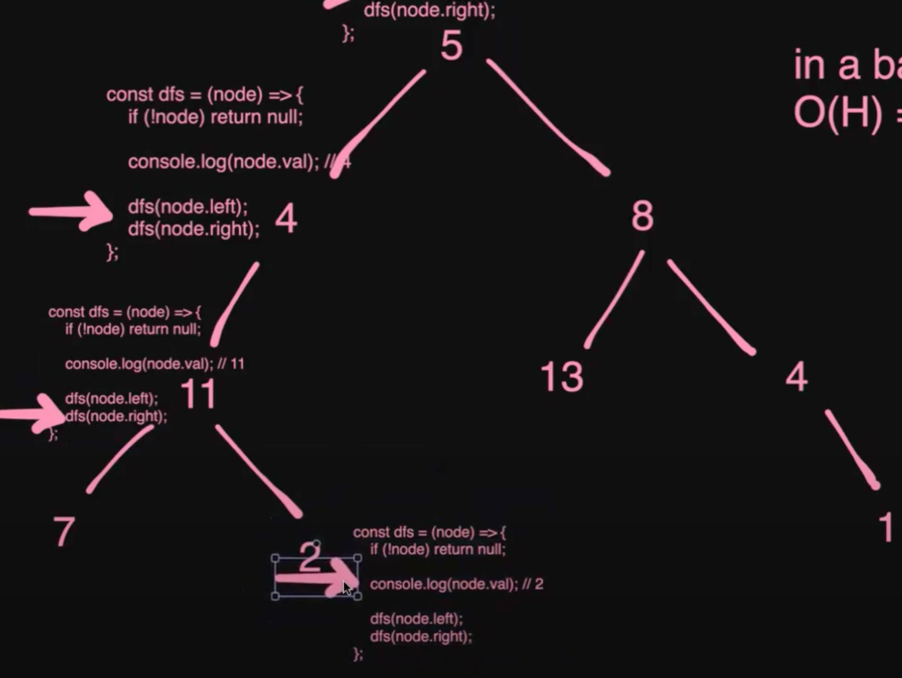
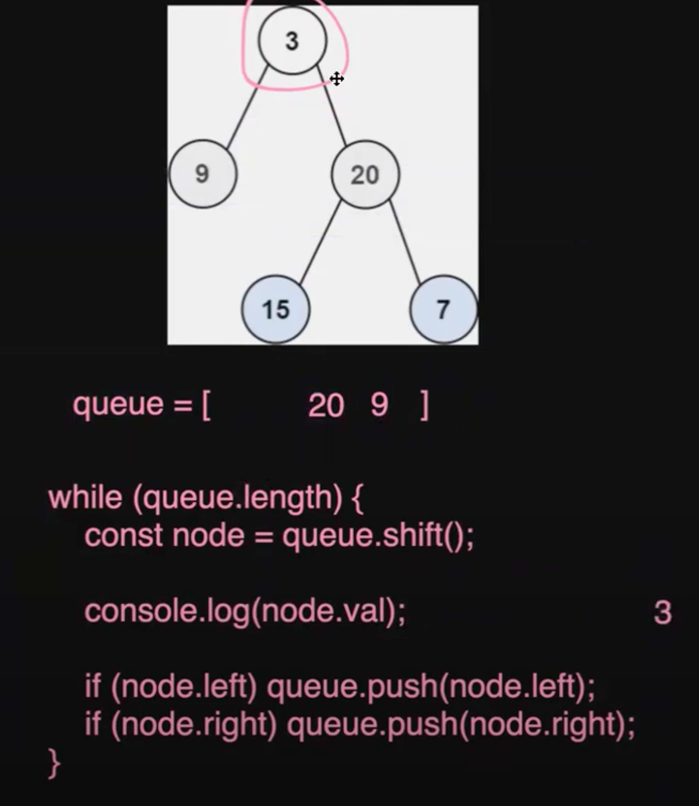
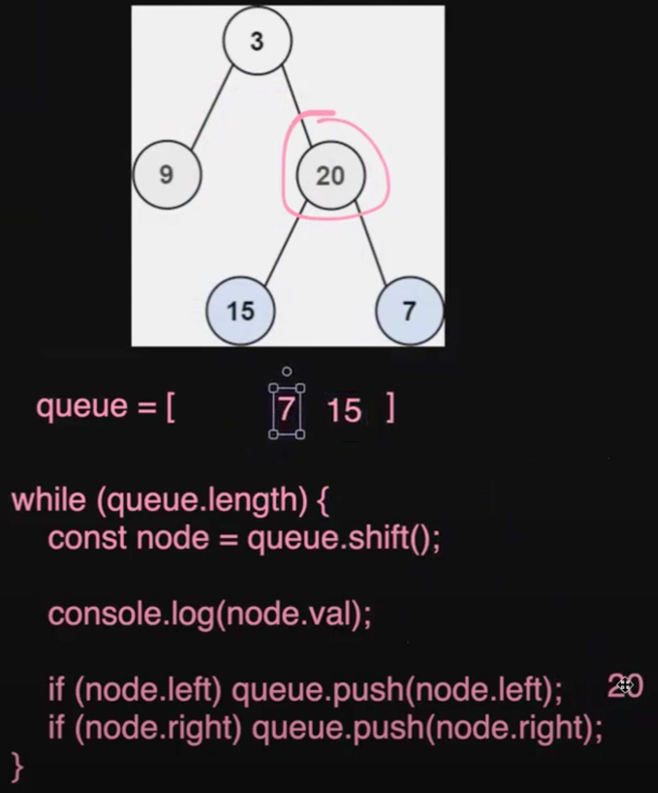
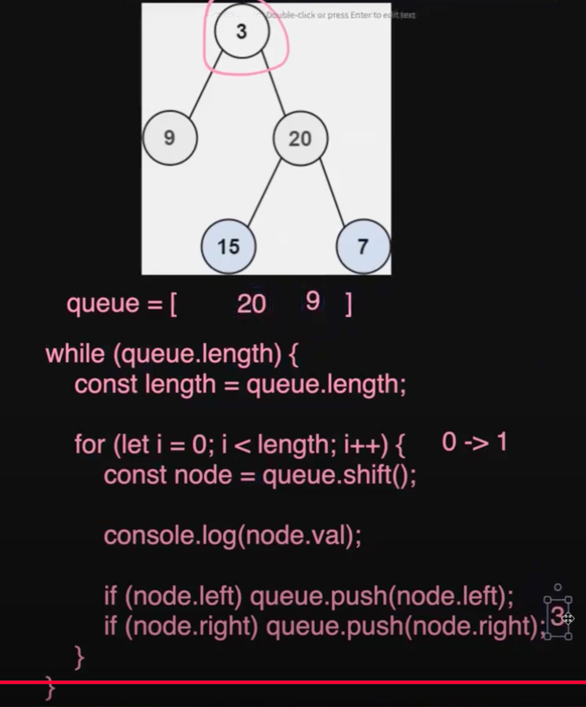

# More BFS, DFS, and Recursion

## Table of Contents

- [Recursive Stack Size](#recursive-stack-size)
- [Balanced Binary Tree](#balanced-binary-tree)
- [Leetcode](#leetcode)
  - [Path Sum](#path-sum)
  - [Binary Tree Level Order Traversal](#binary-tree-level-order-traversal)

## Recursive Stack Size:

- Recursion: the function calling itself
- Stack: data structure in which elements are inserted and deleted only at one end called the "top of the stack". It follows the LIFO (Last in First Out) mechanism.
- _Recursive Stack Size:_
  When a recursive function is invoked, its parameters, local variables, and the return address are stored in an activation record (or stack frame). Each recursive call generates a new activation record, which is pushed onto the call stack. This stack, often called the recursive stack, holds the context of the function call, including its parameters, local variables, and the instruction pointer (return address) to know where to resume after the function finishes. As the function recursively calls itself, new activation records are pushed onto the stack. When the base case is reached or the function call completes, activation records are popped off the stack, and the program returns to the previous function call. The maximum size of the recursive stack corresponds to the maximum depth of recursion at any given point, depending on the number of activation records created.

## Balanced Binary Tree:

- For every node, the absolute difference between the height (or depth) of its left and right subtrees is no greater than 1. Specifically, the difference in height between the left and right subtrees of each node can only be 1 or 0.
- e.g. of self-balancing binary search trees: AVL Tree, Red-Black Tree
- Benefits:
  - Efficient Search: ensure that search operations remain efficient (O(log N)) time complexity
  - Efficient Insert/ Delete: maintain O(log N) time complexity
- In a balanced binary tree, recursive operations (such as searching or inserting) will have a recursive stack size proportional to the tree’s height, which is O(log N) in a balanced tree.
  Recursive Stack: O(H) (height/ depth of tree) = O(log N)

## Leetcode:

### Path Sum

<a href="https://leetcode.com/problems/path-sum/description/" target="_blank">Link</a>






```JavaScript
/** SOLUTION 1
 * Definition for a binary tree node.
 * function TreeNode(val, left, right) {
 *     this.val = (val===undefined ? 0 : val)
 *     this.left = (left===undefined ? null : left)
 *     this.right = (right===undefined ? null : right)
 * }
 */
/**
 * @param {TreeNode} root
 * @param {number} targetSum
 * @return {boolean}
 */


var hasPathSum = function(root, targetSum) {
    // Define the DFS helper function
    const dfs = (node, currSum) => {
        if (!node) return false;

        // Update the current sum by adding the current node's value
        currSum += node.val;

        // at a leaf!
        // Check if it's a leaf and the current sum equals targetSum
        if (!node.left && !node.right) {
            /*
            generally recommended to use === (strict equality) most of the time
            in JavaScript because it ensures that both the value and the type
            are the same, which helps avoid bugs and unexpected behavior that
            can arise from type coercion.
            */
            return currSum === targetSum;
        }

        // Recursively check the left and right subtrees
        return dfs(node.left, currSum) || dfs(node.right, currSum);
    };

    // Start DFS with the root and an initial sum of 0
    return dfs(root, 0);
};
```

```JavaScript
/** SOLUTION 2
 * Instead of accumulating currSum, we decrease remainingSum!
 * Definition for a binary tree node.
 * function TreeNode(val, left, right) {
 *     this.val = (val===undefined ? 0 : val)
 *     this.left = (left===undefined ? null : left)
 *     this.right = (right===undefined ? null : right)
 * }
 */
/**
 * @param {TreeNode} root
 * @param {number} targetSum
 * @return {boolean}
 */

var hasPathSum = function(root, targetSum) {
    const dfs = (node, remainingSum) => {
        if (!node) return false;

        // Subtract the node's value from the remaining sum
        remainingSum -= node.val;

        // If it's a leaf node, check if remainingSum is now 0
        if (!node.left && !node.right) {
            return remainingSum === 0;
        }

        // Recursively check left and right subtrees
        return dfs(node.left, remainingSum) || dfs(node.right, remainingSum);
    };

    return dfs(root, targetSum);
};

```

<br>

### Binary Tree Level Order Traversal

<a href="https://leetcode.com/problems/binary-tree-level-order-traversal/description/" target="_blank">Link</a>





```JavaScript
/** USING QUEUES
 * Definition for a binary tree node.
 * function TreeNode(val, left, right) {
 *     this.val = (val===undefined ? 0 : val)
 *     this.left = (left===undefined ? null : left)
 *     this.right = (right===undefined ? null : right)
 * }
 */
/**
 * @param {TreeNode} root
 * @return {number[][]}
 */

var levelOrder = function(root) {
    // If the root is null, return an empty array (no nodes to process).
    if (!root) {
        return [];
    }

    // Initialize a queue with the root node. We'll use this to track nodes level by level.
    const queue = [root];
    // This array will store the values of nodes for each level.
    const rows = [];

    // Process nodes level by level.
    while (queue.length) {
        // Get the number of nodes at the current level (this corresponds to the queue's length).
        const length = queue.length;

        // Create an array to store the node values for this level.
        const row = [];

        // Process each node at the current level.
        for (let i = 0; i < length; i++) {
            // Dequeue the first node in the queue.
            const node = queue.shift();
            // Add the value of this node to the current row (level).
            row.push(node.val);

            // If this node has a left child, enqueue it to the queue.
            if (node.left) queue.push(node.left);
            // If this node has a right child, enqueue it to the queue.
            if (node.right) queue.push(node.right);
        }

        // After processing all nodes at this level, add the row to the rows array.
        rows.push(row);
    }

    // Return the result, which is the level-order traversal.
    return rows;
};
```

<br>

<!-- Link to Table of Contents -->
<a href="#table-of-contents" style="display: inline-block; text-align: center; margin-top: 20px; font-size: 16px; padding: 10px; text-decoration: none; background-color: #007bff; color: white; border-radius: 5px;">
  Go to Table of Contents
</a>
