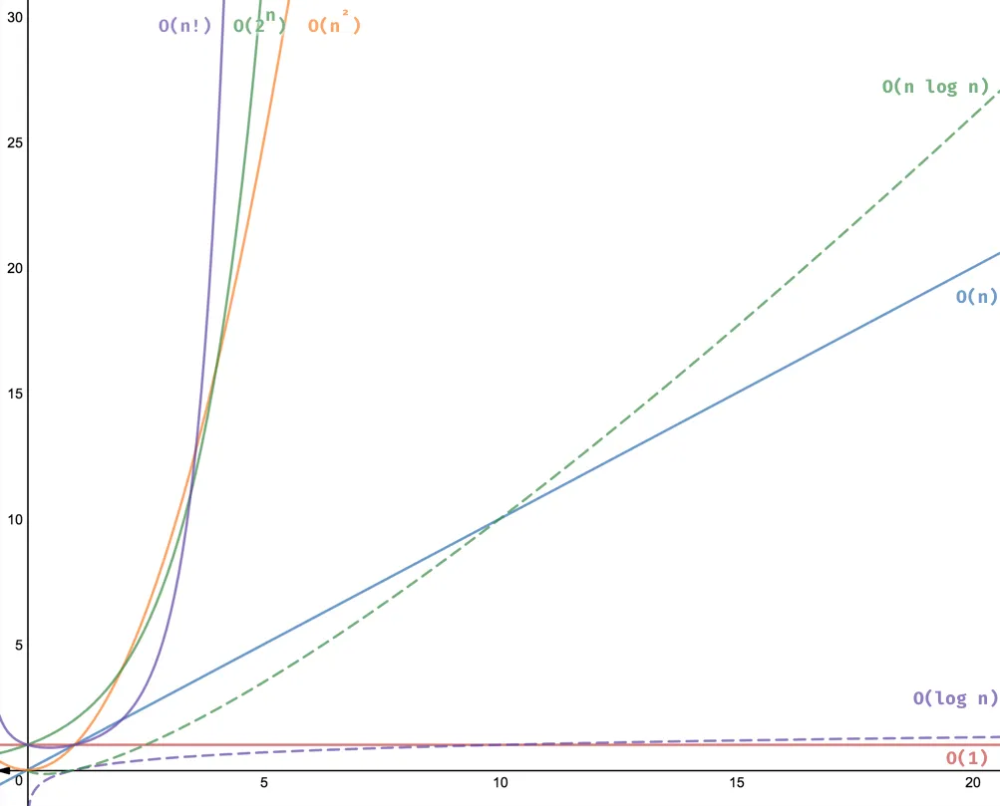
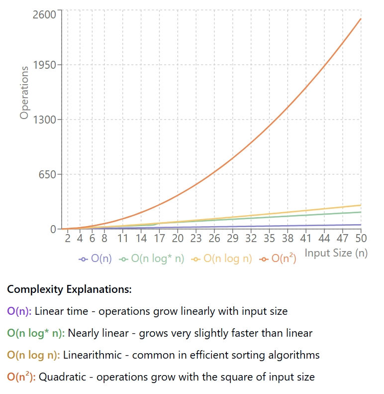

# Big O Notation

**_Big O Time Complexity:_** The worse case for how long this algo will take to run.

**_Big O Space Complexity:_** The worst case for how much new space the algo. will need.

<table>
  <tr>
    <th>Notation</th>
    <th>Name</th>
    <th>Example</th>
  </tr>
  <tr style="background-color: yellow;">
    <td>O(1)</td>
    <td>Constant</td>
    <td>Finding the median value for a sorted array of numbers; Using a constant-size lookup table</td>
  </tr>
  <tr>
    <td>O(α(N))</td>
    <td>Inverse Ackermann Function</td>
    <td>Amortized complexity per operation for the Disjoint-set data structure</td>
  </tr>
  <tr>
    <td>O(log log N)</td>
    <td>Double Logarithmic</td>
    <td>Average number of comparisons spent finding an item using interpolation search in a sorted array of uniformly distributed values</td>
  </tr>
  <tr style="background-color: yellow;">
    <td>O(log N)</td>
    <td>Logarithmic</td>
    <td>Finding an item in a sorted array with a binary search or a balanced search tree; all operations in a binomial heap</td>
  </tr>
  <tr>
    <td>O((log N)c), c > 1</td>
    <td>Polylogarithmic</td>
    <td>Matrix chain ordering can be solved in polylogarithmic time on a parallel random-access machine</td>
  </tr>
  <tr>
    <td>O(Nc), 0 < c < 1</td>
    <td>Fractional Power</td>
    <td>Searching in a k-d tree</td>
  </tr>
  <tr style="background-color: yellow;">
    <td>O(N)</td>
    <td>Linear</td>
    <td>Finding an item in an unsorted list or array; adding two N-bit integers by ripple carry</td>
  </tr>
  <tr>
    <td>O(N log* N)</td>
    <td>N log-star N</td>
    <td>Performing triangulation of a simple polygon using Seidel's algorithm. Very close to O(N)</td>
  </tr>
  <tr style="background-color: yellow;">
    <td>O(N log N) = O(N * log(N))</td>
    <td>Linearithmic (loglinear, quasilinear)</td>
    <td>Performing a fast Fourier transform; fastest possible comparison sort (Merge Sort, Heap Sort, QuickSort worst case); convex hull computation (Graham's scan); priority queue operations in a binary heap</td>
  </tr>
  <tr style="background-color: yellow;">
    <td>O(N²)</td>
    <td>Quadratic</td>
    <td>Multiplying two N-digit numbers by schoolbook multiplication; Bubble sort, Selection sort, Insertion sort; Worst-case bound for quicksort, Shellsort, and tree sort</td>
  </tr>
  <tr>
    <td>O(Nc)</td>
    <td>Polynomial or Algebraic</td>
    <td>Tree-adjoining grammar parsing; Maximum matching for bipartite graphs; Finding the determinant with LU decomposition</td>
  </tr>
  <tr>
    <td>Lₙ[α, c] = e(c+o(1))(ln N)ᵅ(ln ln N)¹⁻ᵅ, 0 < α < 1</td>
    <td>L-notation (Sub-exponential)</td>
    <td>Factoring a number using the quadratic sieve or number field sieve</td>
  </tr>
  <tr>
    <td>O(cN), c > 1</td>
    <td>Exponential</td>
    <td>Finding the (exact) solution to the traveling salesman problem using dynamic programming; Determining if two logical statements are equivalent using brute-force search</td>
  </tr>
  <tr>
    <td>O(N!)</td>
    <td>Factorial</td>
    <td>Solving the travelling salesman problem via brute-force search; Generating all unrestricted permutations of a poset; Finding the determinant with Laplace expansion; Enumerating all partitions of a set</td>
  </tr>
</table>
