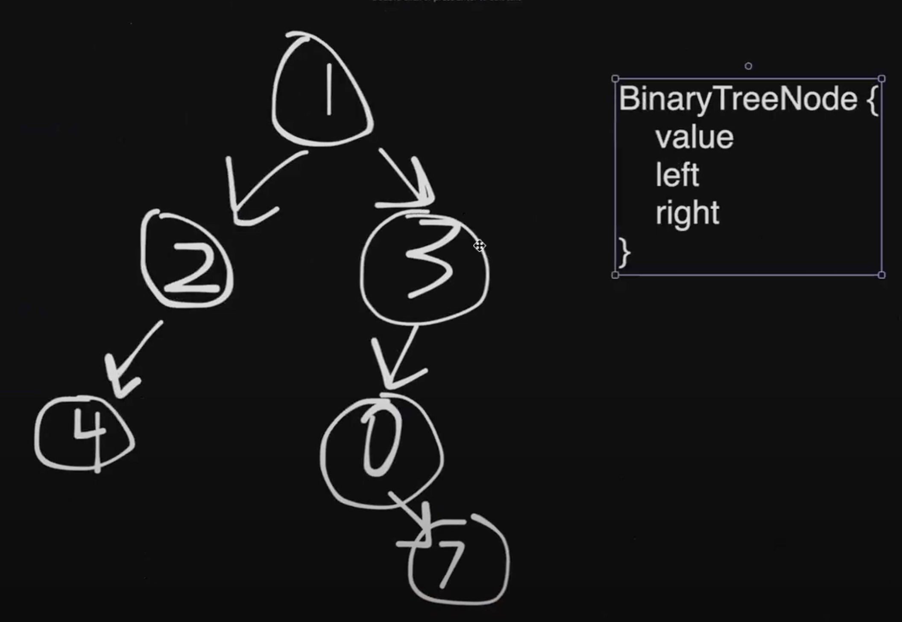
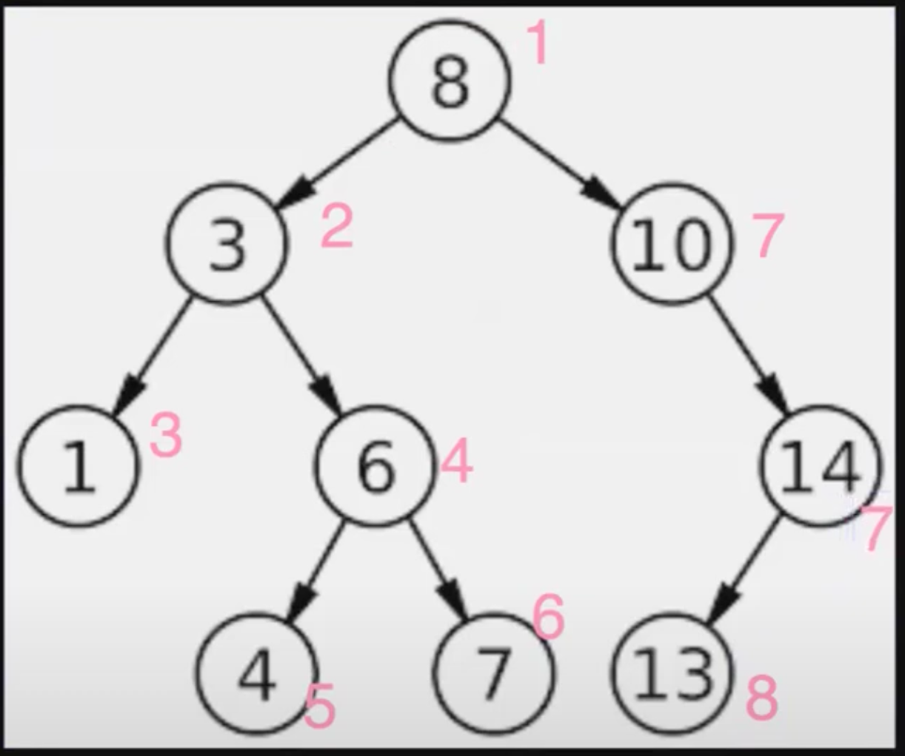
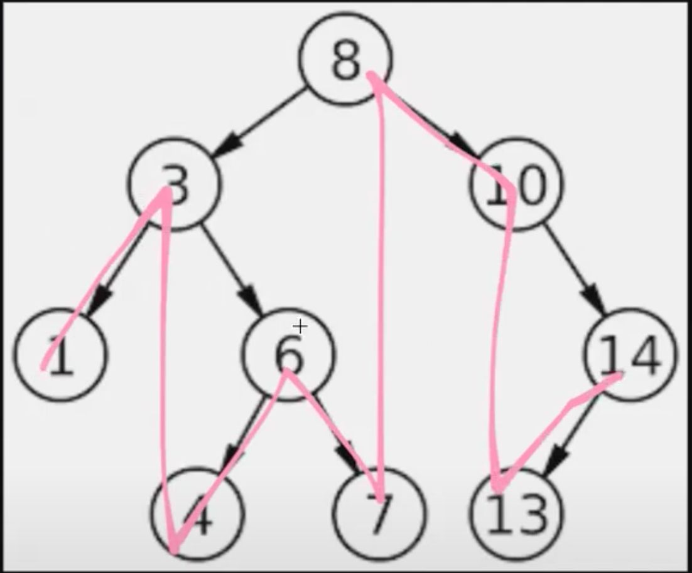

# Binary Trees, BFS, DFS

## Binary Tree



Rules for binary trees:

- At any node, you can only go downwards
- Each node can either have: 0, 1, or 2 children

## Binary Search Tree


Rules:

- At any node, you can only go downwards
- Each node can either have: 0, 1, or 2 children
- Node on left has to be less than (<) root
- Node on right has to be greater than or equal (>=) to root

## Iterating through Binary Trees

There are four different ways of iterating through binary trees (traversing - touching every single node in the tree).

1. DFS (Depth-First Search)

   - Go deepest first, left to right
   - Worst Case Time Complexity: O(N)
   - Worst Case Space Complexity: O(N)
   - Most useful to least useful:
     - DFS Preorder (Root -> Left -> Right)
       1. Visit the root node
       2. Traverse the left subtree
       3. Traverse the right subtree
     - DFS Inorder (Left -> Root -> Right)
       1. Traverse the left subtree
       2. Visit the root node
       3. Traverse the right subtree
     - DFS Postorder (Left -> Right -> Root)

2. BFS (Breadth-First Search)
   - Go row-by-row, left to right
   - Worst Case Time Complexity: O(N)
   - Worst Case Space Complexity: O(N)

### DFS:

We will touch the all nodes in the following order:

- Preorder: 8, 3, 1, 6, 4, 7, 10, 14, 13
    <figure>
    
    <figcaption style="font-style:italic; font-size:12px">DFS Preorder</figcaption>
    </figure>

  ```JavaScript
  // Implementing DFS and Recursion
  // Note DFS works on everything not just nodes, similar to BFS
  // Works for trees, linked-lists, arrays, strings, graphs...
  const dfs = (node) => {
    // 1. base case
    if (!node) {
        return;
    } else {
        console.log(node.val);
    }

    // 2. next steps: traverse your neighbors (left, right)
    dsf(node.left);
    dfs(node.right);
  };
  ```

- Inorder: 1, 3, 4, 6, 7, 8, 10, 13, 14
    <figure>
    
    <figcaption style="font-style:italic; font-size:12px">DFS Inorder</figcaption>
    </figure>
    - Note that for DFS Inorder, you will always get the nodes in order!

- Postorder: 1, 4, 7, 6, 3, 13, 14, 10, 8

### BFS:

We will touch the all nodes in the following order: 8, 3, 10, 1, 6, 14, 4, 7, 13

```JavaScript
// Implementing BFS
// Works for trees, linked-lists, arrays, strings, graphs...

const bfs = (node) => {
    // 1. base case
    if (!node) {
        return null;
    };

    // 2. start a queue with your starting point
    const queue = [node];

    // 3. while (queue.length)...
    while (queue.length) {
        // 4. take the first node out of the queue
        const node = queue.shift();

        // 5. console.log it
        console.log(node.val);

        // 6. traverse your neighbors
        if (node.left) queue.push(node.left); // push if exists
        if (node.right) queue.push(node.right); // push if exists
    }
};
```

---

<br>

<a href="https://leetcode.com/problems/invert-binary-tree/description/" target="\_blank">Leetcode: Invert Binary Tree</a>

```JavaScript
/** USING DFS
 * Definition for a binary tree node.
 * function TreeNode(val, left, right) {
 *     this.val = (val===undefined ? 0 : val)
 *     this.left = (left===undefined ? null : left)
 *     this.right = (right===undefined ? null : right)
 * }
 */
/**
 * @param {TreeNode} root
 * @return {TreeNode}
 */

const dfs = (node) => {
    // 1. base case
    if (!node) {
        return;
    }

    // swap left and right
    const temp = node.left; // need to create a temp
    node.left = node.right;
    node.right = temp;

    // 2. next steps: traverse your neighbors (left, right)
    dfs(node.left);
    dfs(node.right);
};

var invertTree = function(root) {
    dfs(root);
    return root;
};
```

```JavaScript
/** USING BFS
 * Definition for a binary tree node.
 * function TreeNode(val, left, right) {
 *     this.val = (val===undefined ? 0 : val)
 *     this.left = (left===undefined ? null : left)
 *     this.right = (right===undefined ? null : right)
 * }
 */
/**
 * @param {TreeNode} root
 * @return {TreeNode}
 */

const bfs = (node) => {
    // 1. base case
    if (!node) {
        return null;
    };

    // 2. start a queue with your starting point
    const queue = [node];

    // 3. while (queue.length)...
    while (queue.length) {
        // 4. take the first node out of the queue
        const node = queue.shift();

        // 5. console.log it
        const temp = node.left;
        node.left = node.right;
        node.right = temp;

        // 6. traverse your neighbors
        if (node.left) queue.push(node.left); // push if exists
        if (node.right) queue.push(node.right); // push if exists
    }
};

var invertTree = function(root) {
    bfs(root);
    return root;
};
```
