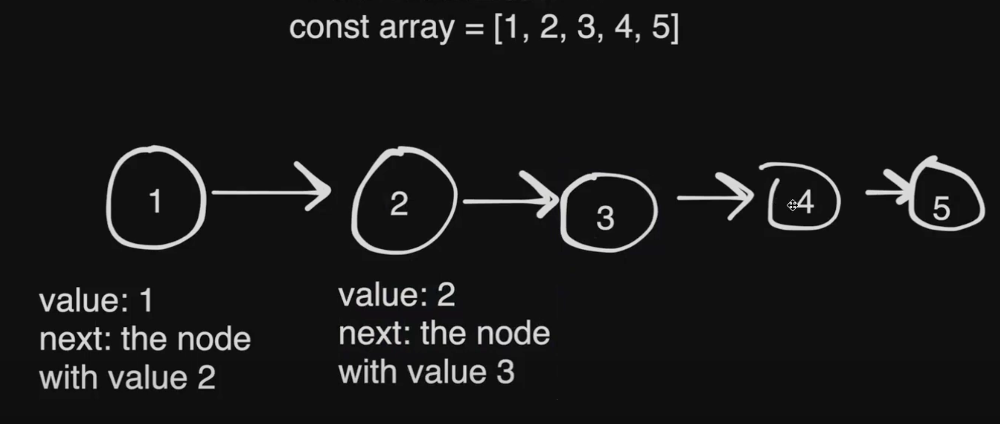
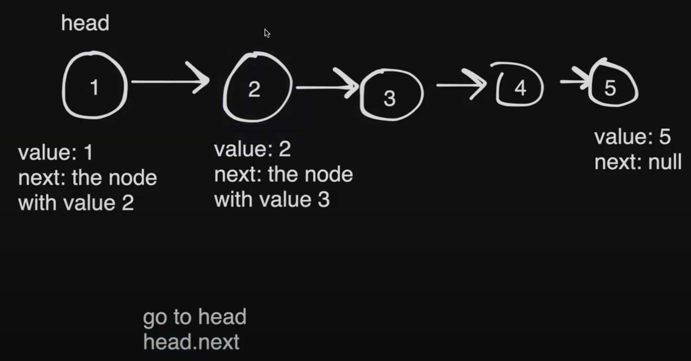
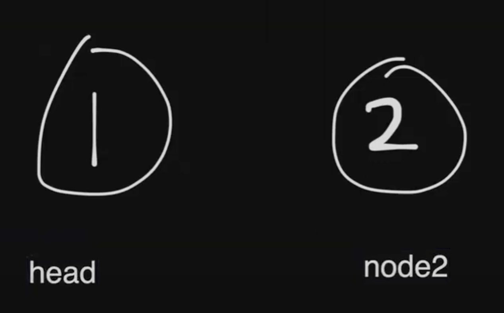
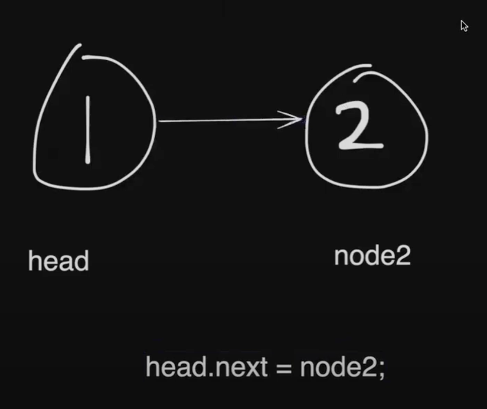
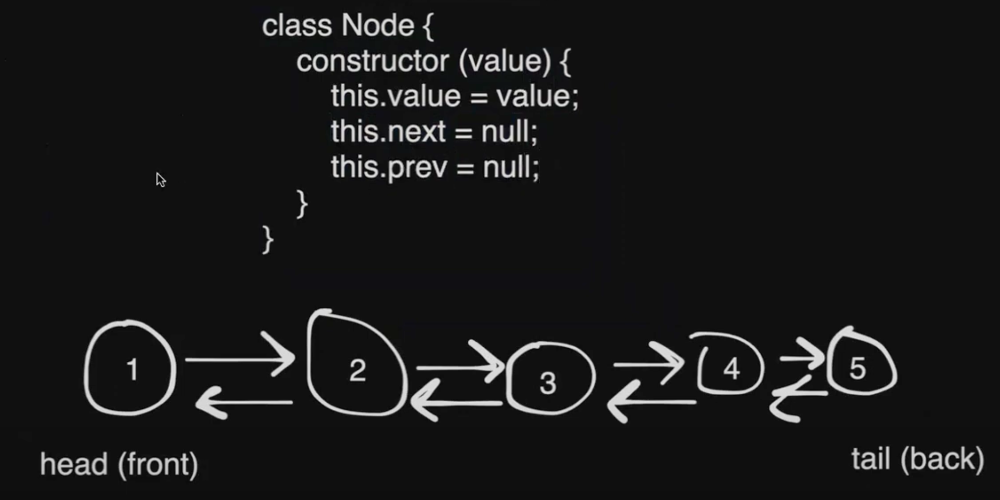
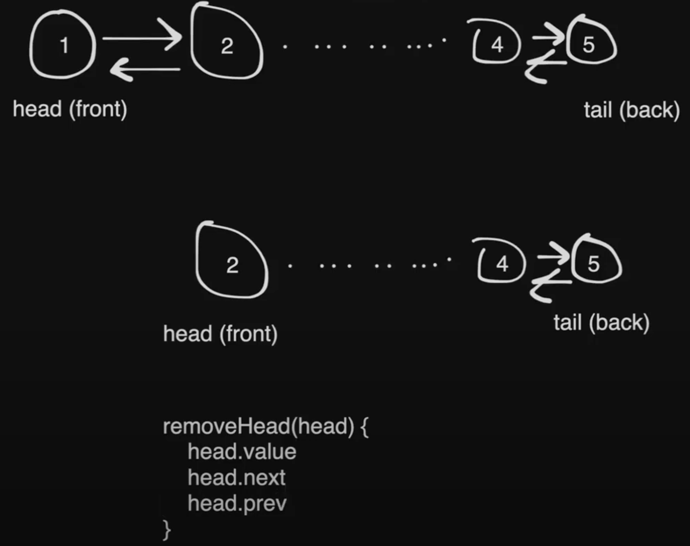
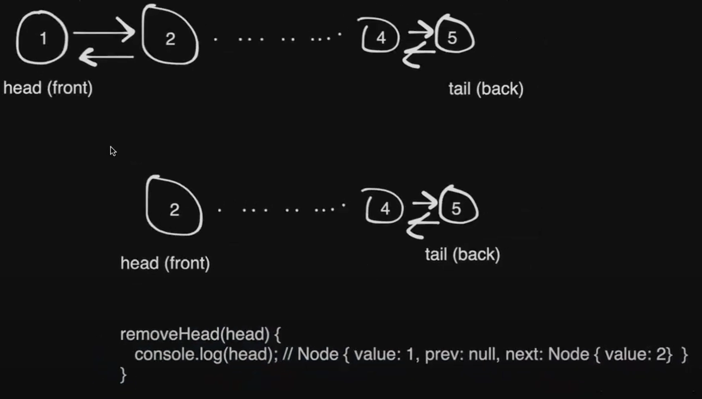

# Linked Lists Day 1

## Table of Contents

1. [Time Complexity Table (Most Relevant in Real World Scenarios)](#time-complexity-table-most-relevant-in-real-world-scenarios)
2. [Classes](#classes)
3. [Singly Linked List Setup](#singly-linked-list-setup)
   - [Queue](#queue)
   - [Iterating through a Linked List](#iterating-through-a-linked-list)
   - [Doubly Linked List](#doubly-linked-list)

## Time Complexity Table (Most Relevant in Real World Scenarios)

| Data Structure | Insert to Back            | Insert to Arbitrary Place?               | Access an Arbitrary Element | Deleting from End | Deleting from Anywhere              |
| -------------- | ------------------------- | ---------------------------------------- | --------------------------- | ----------------- | ----------------------------------- |
| Array          | O(1) (amortized)          | O(N)                                     | O(1) (amortized)            | O(1)              | O(N)                                |
| Map            | ❌ (N/A)                  | O(1) (amortized)                         | O(1) (amortized)            | ❌ (N/A)          | O(1) (amortized)                    |
| Set            | ❌ (N/A)                  | O(1) (amortized)                         | O(1) (amortized)            | ❌ (N/A)          | O(1) (amortized)                    |
| Object         | ❌ (N/A)                  | O(1) (amortized)                         | O(1) (amortized)            | ❌ (N/A)          | O(1) (amortized)                    |
| Linked List    | O(1) (if at head or tail) | O(1) (if pointer to postition available) | O(N) (traverse to find)     | O(1) (tail)       | O(1) (if pointer to node available) |

_amortized_ here means average time per per operation over a sequence of operations.

## Classes

```javascript
class Game {
  // you can define games using classes
  // each game has a name, genre, and dataReleased
  constructor(name, genre, dateReleased) {
    // this.name = "GTA6";
    // this.genre = "RPG";
    // this.dateReleased = "2025-10-01";
    console.log(name, genre, dateReleased);
  }
}
// constructor gets called whenever you run new Game()
const gta6 = new Game("gta6", "RPG", "2025-10-01"); // console log will output: gta6 RPG 2025-10-01

// ---------------------------------------------------------

// updated:
class Game {
  constructor(name, genre, dateReleased) {
    this.name = name;
    this.genre = genre;
    this.dateReleased = dateReleased;
  }
}
const gta6 = new Game("gta6", "RPG", "2025-10-01"); // will no longer output anything
console.log(gta6.genre); // output: RPG

gta6.genre = "COOL"; // will change the genre
console.log(gta6.genre); // output: COOL

// ---------------------------------------------------------

class Game {
  constructor(name, genre, dateReleased) {
    this.name = name;
    this.genre = genre;
    this.dateReleased = dateReleased;
    this.gameVersion = 0;
  }
  // class methods
  incrementGameVersion() {
    this.gameVersion++;
  }

  // another class method
  foo() {
    this.incrementGameVersion();
    console.log(this.name);
  }
}
```

## Singly Linked List Setup




```JavaScript
// definition of a node
class Node {
  constructor(value) {
    this.value = value;
    this.next = null;
  }
}
const head = new Node(1); // new node with value of 1
console.log(head); // output: Node { value: 1, next: null }

const node2 = new Node(2);
```



```javascript
// definition of a node
class Node {
  constructor(value) {
    this.value = value;
    this.next = null;
  }
}
const head = new Node(1); // new node with value of 1
console.log(head); // output: Node { value: 1, next: null }

const node2 = new Node(2);
head.next = node2;
console.log(head); // output: Node { value: 1, next: Node { value: 2, next: null } }
```



### Queue

<u>Array-Based Queues:</u>

FIFO = First in, first out

- Remove from front: array.unshift( ) O(N)
- Insert from back: array.push( ) O(1)

<u>For Linked Lists Queues:</u>

Remove from front: dequeue O(1)
Insert from back: enqueue O(1)

- **Dequeue** (Remove from the front)
  You maintain a pointer to the **head** (front), so removing the first node is O(1).
- **Enqueue** (Insert at the back)
  You maintain a pointer to the **tail** (back) of the list, so adding a new node at the end is O(1).

Singly Linked List is the common choice for queue implementation, but if you need to optimize for more complex operations at both ends (e.g., dequeuing from both front and back), a doubly linked list could be a better choice. Singly linked list are generally more space-efficient since it only requires a reference to the next node in each node.

In a singly linked list, you only need a reference to the head and, optimally, the tail. You don't need to worry about backwards traversal because queue operations (FIFO) only require manipulation at the front and back.

#### Iterating through a Linked List

```javascript
// head is still truthy (if it is not null)
// if at any point head is null, break out of the while loop
while (head) {
  head = head.next;
}
```

### Doubly Linked List



A doubly linked list could be used if you want to optimize for **both ends** (i.e. if you need to access or remove nodes from the front and back frequently).

It provides O(1) access to both ends because each node has a reference to both the next and previous node, so both **enqueuing** and **dequeuing** would be O(1) from either end.





<br />
<br />

<a href="https://leetcode.com/problems/linked-list-cycle/description/" target="_blank">Leetcode: Linked List Cycle</a>

```JavaScript
/*
 * Definition for singly-linked list.
 * function ListNode(val) {
 *     this.val = val;
 *     this.next = null;
 * }
 */

/*
 * @param {ListNode} head
 * @return {boolean}
 */
var hasCycle = function(head) {
    while (head) {
        if (head.marked === true) {
            return true;
        }
        head.marked = true;
        head = head.next;
    }
    return false;
};
```

<br />

<!-- Link to Table of Contents -->
<a href="#table-of-contents" style="display: inline-block; text-align: center; margin-top: 20px; font-size: 16px; padding: 10px; text-decoration: none; background-color: #007bff; color: white; border-radius: 5px;">
  Go to Table of Contents
</a>
