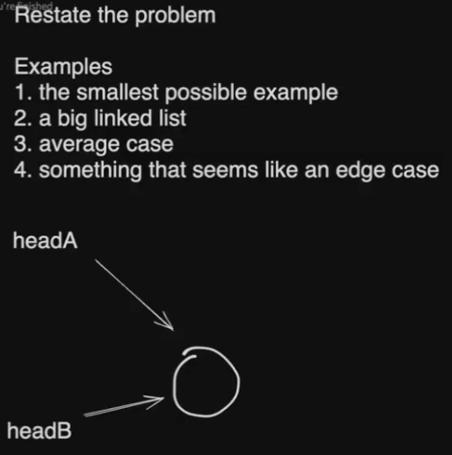
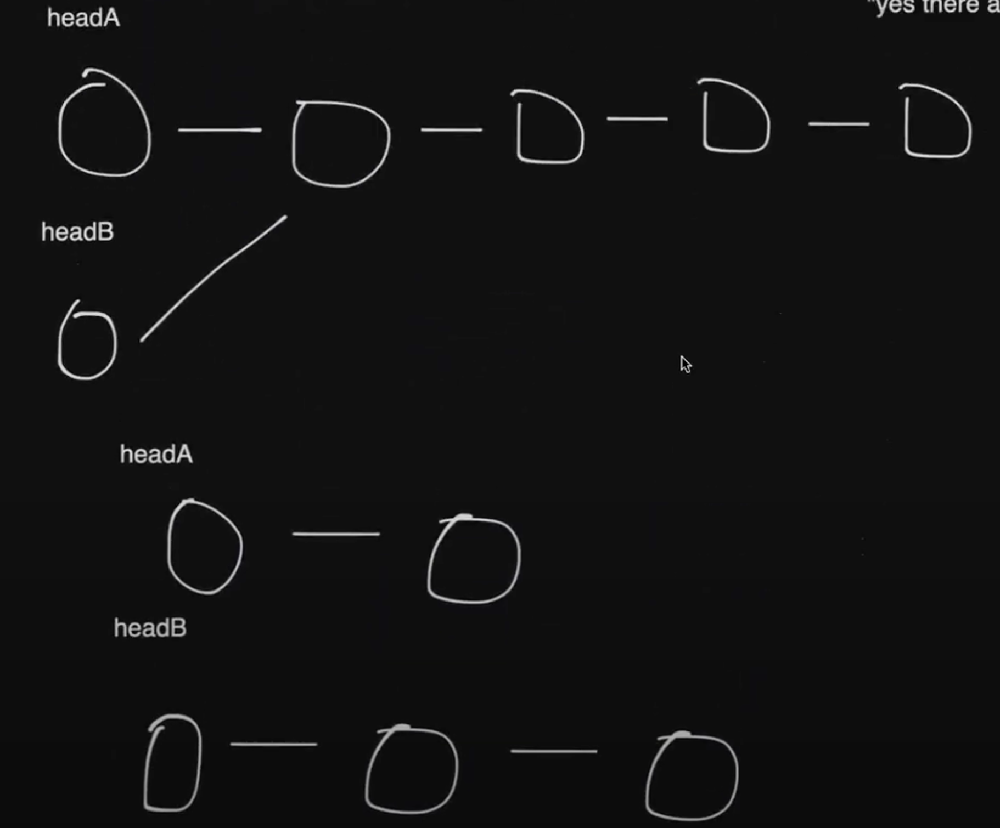
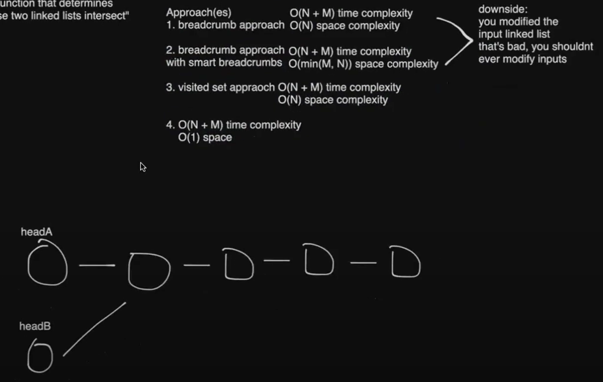
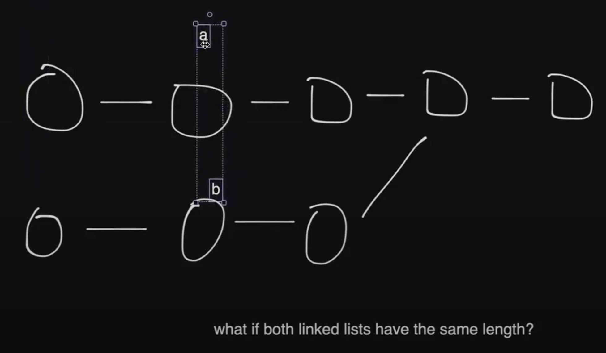
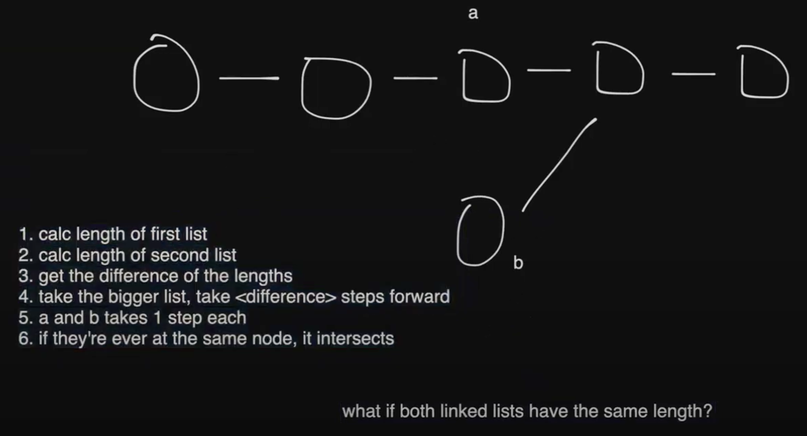

# REACTO and Linked List Intersection

<a href="https://leetcode.com/problems/intersection-of-two-linked-lists/description/" target="\_blank">Leetcode: Intersection of Two Linked Lists</a>







## Visited Set Approach:

```JavaScript
/*
 * Definition for singly-linked list.
 * function ListNode(val) {
 *     this.val = val;
 *     this.next = null;
 * }
 */

/*
 * @param {ListNode} headA
 * @param {ListNode} headB
 * @return {ListNode}
 */
var getIntersectionNode = function(headA, headB) {
    const visited = new Set();

    while (headA) {
        visited.add(headA);
        headA = headA.next;
    }

    while (headB) {
        if (visited.has(headB)) {
            return headB;
        }
        headB = headB.next;
    }
    return null;
};
```

## REACTO

- R - Restate the problem
- E - Examples
- A - Approach(es)
- C - Code (the solution interviewer says yes to)
- T - Test your solution
- O - Optimize your solution

## Solving the Question Using Constant Space O(1):





```JavaScript
/*
 * Definition for singly-linked list.
 * function ListNode(val) {
 *     this.val = val;
 *     this.next = null;
 * }
 */

/*
 * @param {ListNode} headA
 * @param {ListNode} headB
 * @return {ListNode}
 */

// generic function to get length:
const getLengthOfList = (head) => {
    let length = 0;

    while (head) {
        length++;
        head = head.next
    }
    return length;
}

var getIntersectionNode = function(headA, headB) {
    const headALength = getLengthOfList(headA); // ex. length = 5
    const headBLength = getLengthOfList(headB); // ex. length = 10

    let difference =  Math.abs(headALength - headBLength);

    // shrink headA by the difference if headA is bigger
    if (headALength > headBLength) {
        for (let i = 0; i < difference; i++) {
            headA = headA.next
        }
    // shrink headB by the difference if headB is bigger
    } else if (headALength < headBLength) {
        for (let i = 0; i < difference; i++) {
            headB = headB.next
        }
    }

    while (headA && headB) {
        if (headA === headB) {
            return headA; // doesn't really matter what you return since they are at same node
        };
        headA = headA.next;
        headB = headB.next;
    }
    return null; // if never found
};
```

- Time Complexity: \( O( \max (M, N)) \)
- Space Complexity: \( O(1) \)
